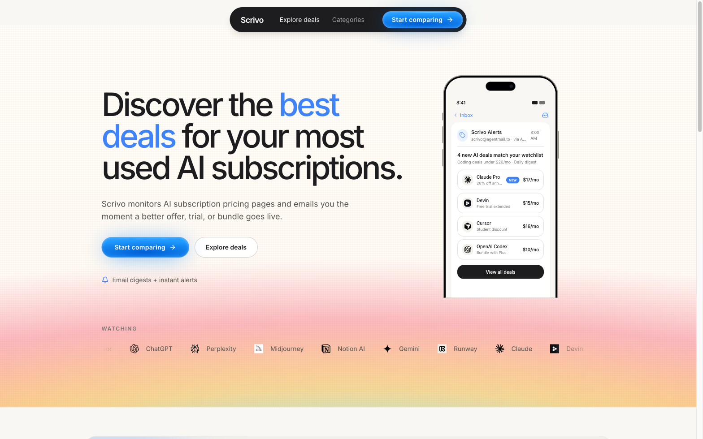
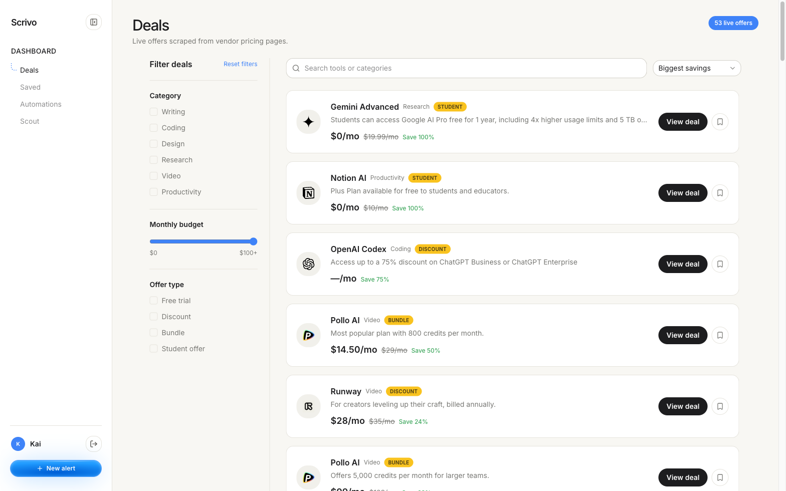
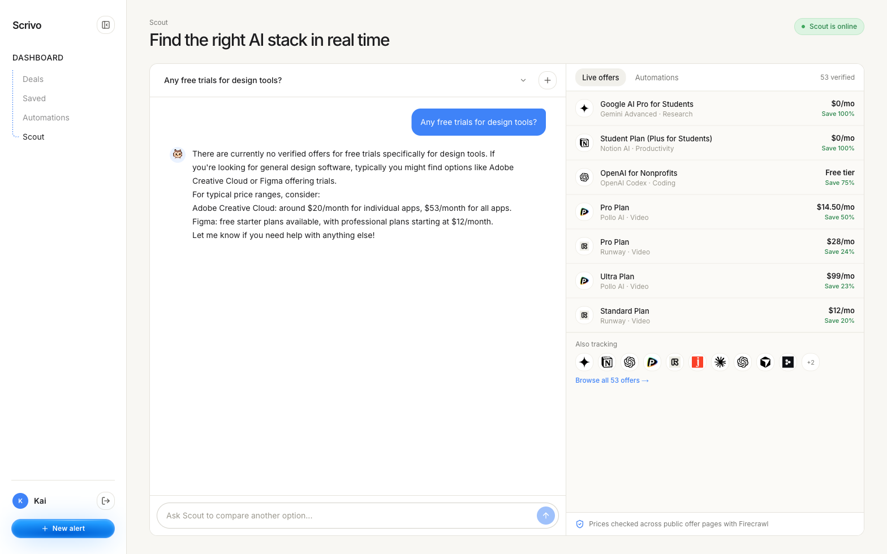
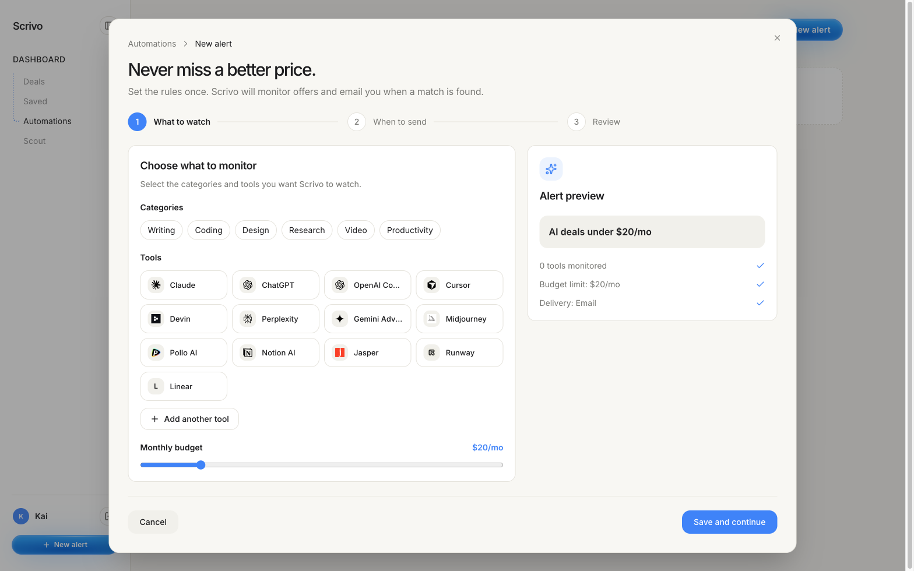
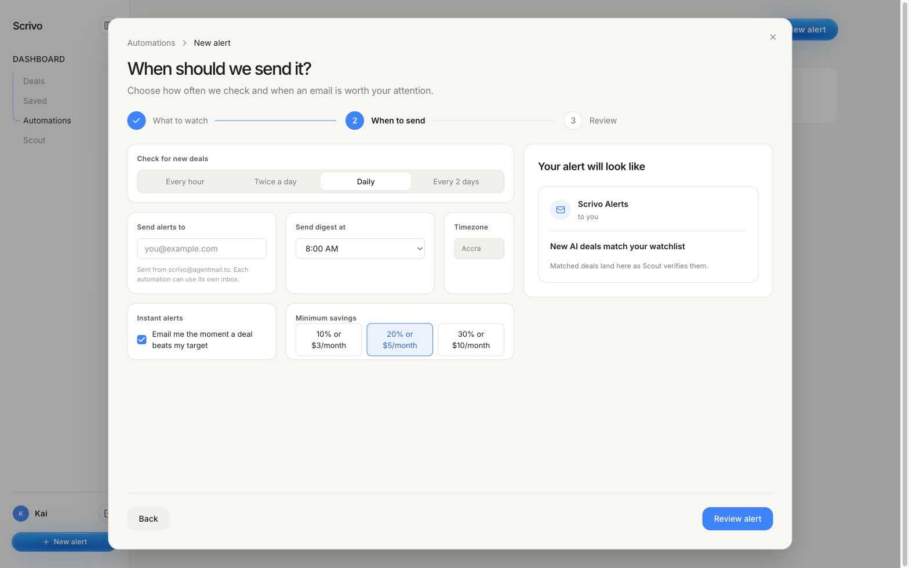
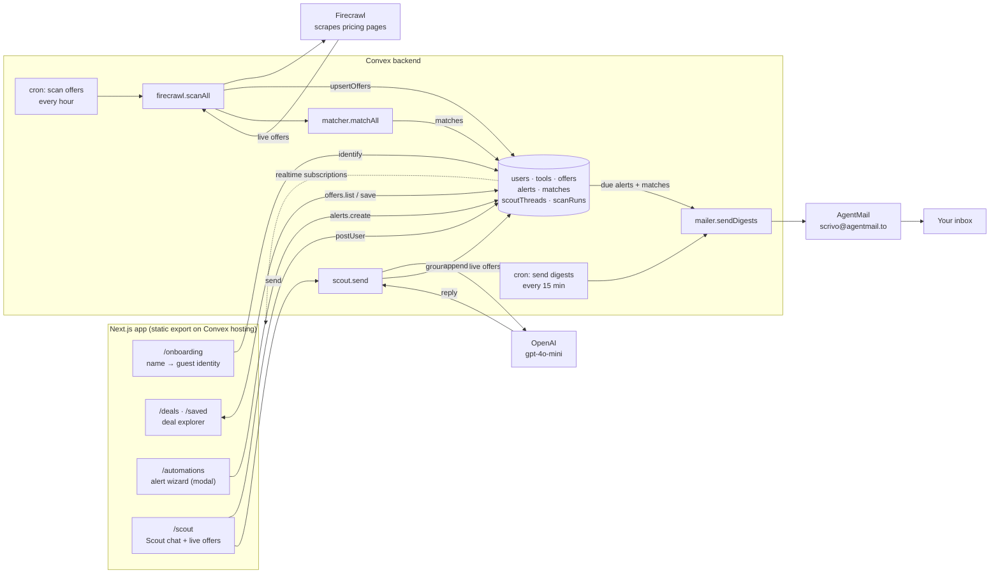

# Scrivo

Scrivo monitors AI subscription pricing pages and emails you when a better
deal, trial, or bundle goes live. Ask **Scout**, the built-in assistant, to
compare tools against your budget — every recommendation is grounded in
Firecrawl-verified offer data.

**Live:** https://ideal-seahorse-109.convex.site

## About

### The problem

Most people who use AI seriously pay for three to six subscriptions —
Claude, ChatGPT, Cursor, Midjourney, Notion AI, Perplexity — and almost
all of them are overpaying. Vendors change pricing constantly, run
student and team discounts nobody hears about, bundle plans, and
quietly ship free tiers that would cover half of what you use the paid
tier for. None of this is announced. The only way to catch it is to
re-read a dozen pricing pages every week, so nobody does.

### How it works

1. **Scrivo watches pricing pages for you.** Every hour a Convex cron
   fires Firecrawl at each tracked tool's pricing page and extracts the
   live offers — price, original price, savings %, offer type (free
   trial, discount, student, bundle) and the URL to claim it.
2. **You set rules once.** Pick categories and tools, a monthly budget,
   how often you want a digest, and a savings threshold that's worth an
   instant email. Scrivo sends a test email with real sample deals the
   moment you save, so you know the address works before anything
   matters.
3. **Matches land in your inbox.** A second cron compares every active
   alert against the live offers and emails you through AgentMail — a
   digest on your schedule, or immediately when a deal beats your
   threshold.
4. **Ask Scout.** A chat assistant answers "best coding stack under
   $40?" using only the offers currently in the database — no
   hallucinated prices, every recommendation links to a verified page.

### Notable features

- **Real offers only.** Nothing in the deal feed is hand-typed; every row
  came from a Firecrawl scrape of a public pricing page and carries its
  source URL.
- **Add any tool on the fly.** Type "Linear" in the alert wizard and
  Firecrawl finds its pricing page, scrapes it, and it joins your
  watchlist — no catalog gatekeeping.
- **Test-email-first alerts.** The first email is a welcome digest with
  sample deals; the cadence clock starts from that confirmed send.
  Delivery status shows live on the automation card, with one-click
  resend.
- **Grounded AI.** Scout's answers are constrained to live offer data and
  stream in with a typewriter effect; the live-offers pane re-ranks to
  whatever tools the conversation mentions.
- **Zero-friction identity.** No signup wall — enter a name and you're in.
  The same name restores your alerts, saves and chat threads on any
  device. Clerk sign-in is a drop-in option when a publishable key is
  set.
- **Fully static, fully realtime.** Next.js static export hosted on
  Convex; every list updates live through Convex subscriptions.

### Why we built this

We were the target user. Between us we were paying for Claude Pro,
ChatGPT Plus, Cursor and Perplexity, and found out weeks late that two
of them had launched cheaper tiers and one had a student plan we
qualified for. The tooling to fix this — a scraper that can read any
pricing page, a scheduler, an email API, an LLM — all exists now; nobody
had wired it into something you set up once and forget.

### Tech stack

- **Frontend:** Next.js 16 (App Router, static export), React 19,
  Tailwind CSS 4, shadcn/base-ui + Prompt Kit chat components,
  `page-mascot` for Scout's owl
- **Backend:** Convex — schema, queries, mutations, actions, crons,
  scheduler, and static hosting for the built site
- **Scraping:** Firecrawl (scrape + search for pricing-page discovery)
- **Email:** AgentMail (`scrivo@agentmail.to`)
- **LLM:** OpenAI `gpt-4o-mini` via the Vercel AI SDK
- **Auth:** browser guest identity keyed by username; Clerk optional
- **Tooling:** TypeScript end to end, Playwright for browser verification

### Challenges we ran into

- **Pricing pages are hostile to scrapers.** Prices live in toggles
  (monthly/annual), tabs, and JS-rendered tables. We lean on Firecrawl's
  structured extraction and store `originalPriceCents` alongside
  `priceCents` so savings are computed, not trusted.
- **"Verified" has to mean something.** Early versions mixed seeded
  sample deals with scraped ones and it was impossible to tell which was
  real. We deleted every seeded offer and made the rule absolute: if
  Firecrawl didn't see it, it isn't in the feed.
- **Email you can trust.** Fire-and-forget sending meant users couldn't
  tell if the address was right until the first digest a day later. The
  welcome/test email plus live delivery status on the card fixed that,
  and the cadence now counts from a confirmed send.
- **Identity without friction.** A random per-browser id meant "log out
  and come back" lost everything. We made the normalised username the
  account key, with a guard so a guest can never claim a Clerk user's
  data.
- **Keeping the deploy honest.** The static export drifted from the repo
  more than once (a hardcoded placeholder avatar shipped for days).
  Every change now goes commit → push → `convex deploy` → static upload
  in one step, and the README documents it.

### Metrics so far

- **13 AI tools** tracked (Claude, ChatGPT, OpenAI Codex, Cursor, Devin,
  Perplexity, Gemini Advanced, Midjourney, Pollo AI, Notion AI, Jasper,
  Runway, Linear)
- **100 offers** in the database, 100% Firecrawl-scraped, including
  100%-off student plans and 20–75% discounts on paid tiers
- **21 scan runs** completed on the production deployment, on an hourly
  schedule
- Welcome and digest emails delivered end to end through AgentMail,
  verified by receiving them in the sender inbox
- Fresh project — no external users yet; the numbers above are the
  system running against real vendor pages.

## Screenshots

| Landing | Deals |
| --- | --- |
|  |  |

| Scout chat | New alert — what to watch |
| --- | --- |
|  |  |

| New alert — when to send |
| --- |
|  |

## How it works



1. **Watch.** Every hour `firecrawl.scanAll` scrapes each tracked tool's
   pricing page and `matcher.upsertOffers` stores what it finds in `offers`.
   Users can add any tool from the wizard — Firecrawl finds its pricing page
   on the fly.
2. **Match.** `matcher.matchAll` compares every active alert (categories,
   tools, budget, savings threshold) against the live offers and writes
   `matches`.
3. **Notify.** Every 15 minutes `mailer.sendDigests` picks alerts whose
   digest window is due (or whose instant threshold was hit) and sends one
   email per alert from `scrivo@agentmail.to`.
4. **Ask.** Scout answers questions with the LLM, but only over the offers
   currently in the database — no hallucinated prices.

## Stack

| Layer      | Tech                                                        |
| ---------- | ----------------------------------------------------------- |
| Frontend   | Next.js 16 (App Router, static export), React 19, Tailwind CSS 4 |
| Components | shadcn (base-ui) + Prompt Kit AI components, `page-mascot` owl for Scout |
| Backend    | Convex (schema, queries, mutations, actions, crons) + Convex static hosting |
| Auth       | Browser guest identity by default; Clerk optional (`ConvexProviderWithClerk`) |
| Scraping   | Firecrawl — verifies pricing/offer pages                      |
| Email      | AgentMail — deal alerts + digests                             |
| LLM        | OpenAI via Vercel AI SDK (`ai` + `@ai-sdk/openai`) for Scout  |

## Pages

| Route           | Purpose                                                        |
| --------------- | -------------------------------------------------------------- |
| `/`             | Landing — hero on alternating gradient backgrounds, iPhone mockup showing a deal digest email, live deal explorer |
| `/deals`        | Filterable deal explorer (category, budget, offer type, search)  |
| `/onboarding`   | Name-first onboarding → guest identity in `users`                 |
| `/automations`  | Alert dashboard — status toggle, recent matches, scan activity. "New alert" opens the 3-step wizard (watch → schedule → review) as a modal; `/automations?new=1` deep-links to it |
| `/alerts/new`   | Redirects to `/automations?new=1` (kept for old links)           |
| `/saved`        | Bookmarked offers                                                |
| `/scout`        | Scout chat — threads, live offer panel, prompt-kit UI            |

## Convex backend

```
schema.ts      users, tools, offers, profiles, alerts, matches,
               scoutThreads, scoutMessages, savedOffers, scanRuns
users.ts       store() — Clerk identity upsert
tools.ts       seed catalog + ensureSeeded()
offers.ts      list/count/save/saved
profiles.ts    upsert() — onboarding preferences
alerts.ts      create/mine/setStatus/remove/matchesFor/lastScan
matcher.ts     scan bookkeeping, offer upsert, alert matching, digest selection
firecrawl.ts   scanAll internalAction — scrapes each tool's pricingUrl
mailer.ts      AgentMail send + sendDigests runner
scout.ts       send action — LLM reply grounded in live offers
scoutDb.ts     threads/messages/history/append/liveOffers
crons.ts       hourly offer scan + digest delivery every 15 min
```

## Environment variables

`.env.local` (frontend + `convex dev` writes `NEXT_PUBLIC_CONVEX_URL`):

```
NEXT_PUBLIC_CONVEX_URL=         # from `npx convex dev`
NEXT_PUBLIC_CLERK_PUBLISHABLE_KEY=
CLERK_JWT_ISSUER_DOMAIN=        # convex/auth.config.ts if configured
```

Convex dashboard → Settings → Environment Variables:

```
FIRECRAWL_API_KEY=
AGENTMAIL_API_KEY=
AGENTMAIL_INBOX=scrivo@agentmail.to
OPENAI_API_KEY=                                # Scout agent (Vercel AI SDK)
OPENAI_BASE_URL=                               # optional — Azure/proxy endpoint
SCOUT_MODEL=gpt-4o-mini                        # optional override
```

## Setup

```bash
npm install
npx convex dev        # provisions a deployment, writes .env.local, runs codegen
# in another terminal:
npm run dev           # next dev
```

First run: seed the tool catalog once via the Convex dashboard
(`tools:ensureSeeded`) or let onboarding do it. Set the env vars above before
relying on scans, email, or Scout replies.

## Deploy

```bash
npm run deploy        # convex deploy --prod + next build + upload out/ to Convex static hosting
```

Convex prompts before pushing to prod; in a non-interactive shell run
`npx convex deploy --yes --cmd 'npm run build' --cmd-url-env-var-name NEXT_PUBLIC_CONVEX_URL && node scripts/upload-static.mjs --prod --dist out`.

## Design notes

- Flowstep-derived token system in `app/globals.css` — warm off-white
  `#F8F7F3`, ink `#1D1D1F`, blue `#3F83F8`, 14–22px radii.
- Landing hero crossfades between `ArcBandsBackground` and
  `SandDriftBackground` (opensourceui) via `BackgroundSwitcher`.
- iPhone mockup (`PhoneMockupCard`) renders `DealEmailScreen` — the digest
  email users will actually receive.
- Scout chat uses Prompt Kit: `ChatContainer`, `Message`, `PromptInput`,
  `PromptSuggestion`, `TextShimmer`.
- `convex/_generated/api.d.ts` was hand-synced to the current modules; run
  `npx convex dev` once to regenerate it properly.
